<div align="center">


# GitHub Profile Achievements

**The complete unofficial catalog** — every badge, every tier, every highlight, every retired design.

[How it works](#how-it-works) · [Active](#active) · [GitHub staff](#github-staff) · [Retired](#retired) · [Unreleased](#unreleased) · [Tiers](#tiers) · [Highlights](#highlights) · [Follow the news](#follow-the-news)

<p>
  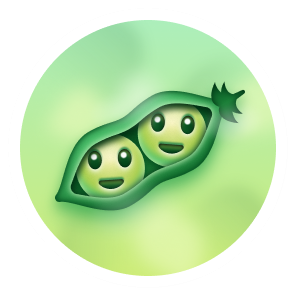
  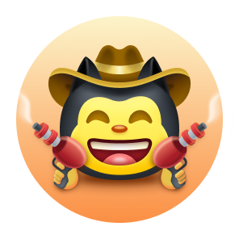
  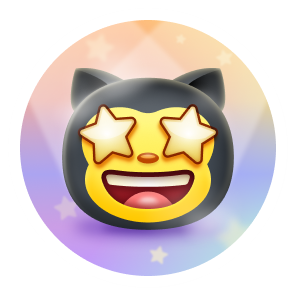
  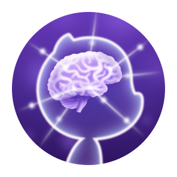
  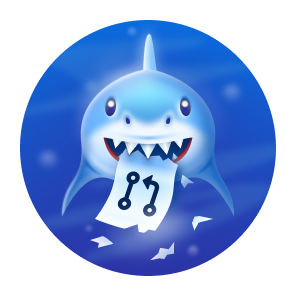
  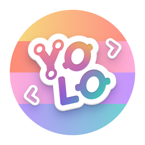
  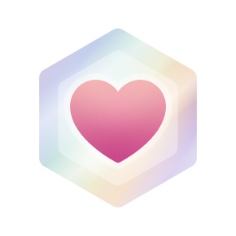
</p>

<p>
  
  
  
  
  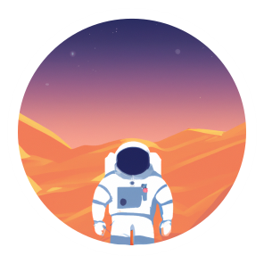
  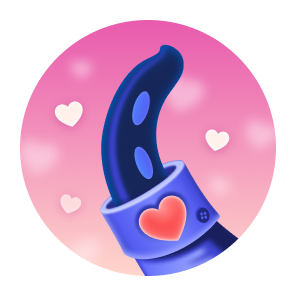
  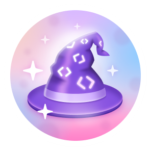
</p>

</div>

---

Achievements appear in the sidebar of a GitHub profile. GitHub does not publish a full official list, so this repository is the reference: criteria, tiers, skin-tone variants, profile highlights, staff-only badges, historic 2021 artwork, and full unlocked dialogs in light and dark mode.

> This feature is in [public preview](https://docs.github.com/en/account-and-profile/reference/profile-reference#earning-achievements) and can change. Thresholds below are community-verified.

The catalog is split by status: **[active](#active)** (you can still earn them), **[GitHub staff](#github-staff)** (internal only), **[retired](#retired)** (Arctic, Mars — they stay on profiles but nobody new can unlock them), and **[unreleased](#unreleased)** (seen in experiments; GitHub has not said if or when they ship).

## How it works

| | |
| --- | --- |
| **Where they show** | Small badges in the profile sidebar. Hover or click for the unlocked dialog, a short hint, and links to the events that earned it. |
| **Private events** | Links stay hidden from anyone who cannot access the repository or organization. Private contributions can still count unless you turn that off. |
| **Opt out** | Achievements are on by default. Hide them in [profile settings](https://github.com/settings/profile#profile-settings-heading). |
| **Skin tone** | Starstruck and Quickdraw follow your [emoji skin tone](https://github.com/settings/appearance#emoji-heading). |
| **Not the same as Highlights** | Achievements are activity badges. Highlights (Pro, Campus Expert, …) are program badges under the bio. |

## Active

Earnable on a normal account today. Galaxy Brain is limited: it still works in **repository** Discussions, not in GitHub Community.

<table>
<thead>
<tr>
<th align="center">Badge</th>
<th>Achievement</th>
<th>How to earn</th>
<th align="center">Default</th>
<th align="center">Bronze</th>
<th align="center">Silver</th>
<th align="center">Gold</th>
</tr>
</thead>
<tbody>
<tr>
<td align="center"></td>
<td><strong>Pair Extraordinaire</strong></td>
<td><a href="https://docs.github.com/en/pull-requests/committing-changes-to-your-project/creating-and-editing-commits/creating-a-commit-with-multiple-authors">Coauthored</a> commits on a merged pull request (<code>Co-authored-by: Name &lt;email&gt;</code>)</td>
<td align="center">1</td>
<td align="center">10</td>
<td align="center">24</td>
<td align="center">48</td>
</tr>
<tr>
<td align="center"></td>
<td><strong>Quickdraw</strong></td>
<td>Close an issue or pull request within 5 minutes of opening</td>
<td align="center">1</td>
<td align="center">—</td>
<td align="center">—</td>
<td align="center">—</td>
</tr>
<tr>
<td align="center"></td>
<td><strong>Starstruck</strong></td>
<td>Create a repository that reaches this many stars</td>
<td align="center">16</td>
<td align="center">128</td>
<td align="center">512</td>
<td align="center">4096</td>
</tr>
<tr>
<td align="center"></td>
<td><strong>Galaxy Brain</strong></td>
<td>Have a Discussions reply marked as the accepted answer. <strong>Not</strong> awarded in <a href="https://github.com/orgs/community/discussions/106536">GitHub Community</a> since Feb 2024</td>
<td align="center">2</td>
<td align="center">8</td>
<td align="center">16</td>
<td align="center">32</td>
</tr>
<tr>
<td align="center"></td>
<td><strong>Pull Shark</strong></td>
<td>Open a pull request that gets merged</td>
<td align="center">2</td>
<td align="center">16</td>
<td align="center">128</td>
<td align="center">1024</td>
</tr>
<tr>
<td align="center"></td>
<td><strong>YOLO</strong></td>
<td>Merge <strong>your own</strong> pull request with no review (bot reviews often block it)</td>
<td align="center">1</td>
<td align="center">—</td>
<td align="center">—</td>
<td align="center">—</td>
</tr>
<tr>
<td align="center"></td>
<td><strong>Public Sponsor</strong></td>
<td>Sponsor an open source contributor via <a href="https://github.com/sponsors">GitHub Sponsors</a></td>
<td align="center">1</td>
<td align="center">—</td>
<td align="center">—</td>
<td align="center">—</td>
</tr>
</tbody>
</table>

## GitHub staff

Internal only. Awarded for GitHub’s own “Proxima” work. You cannot earn these through public activity.

<table>
<thead>
<tr>
<th align="center">Badge</th>
<th>Achievement</th>
<th>Earned by</th>
<th>Live example</th>
</tr>
</thead>
<tbody>
<tr>
<td align="center"></td>
<td><strong>Proxima Pioneer</strong></td>
<td>M0 participant — contributed to the Proxima POC</td>
<td><a href="https://github.com/brannon?achievement=proxima-pioneer&tab=achievements">@brannon</a></td>
</tr>
<tr>
<td align="center"></td>
<td><strong>Proxima Staffshipper</strong></td>
<td>M8 participant — shipped a Proxima Staffship instance</td>
<td><a href="https://github.com/brannon?achievement=proxima-staffshipper&tab=achievements">@brannon</a></td>
</tr>
<tr>
<td align="center"></td>
<td><strong>Proxima Staffuser</strong></td>
<td>Team onboarded to Proxima</td>
<td><a href="https://github.com/timrogers?achievement=proxima-staffuser&tab=achievements">@timrogers</a></td>
</tr>
</tbody>
</table>

## Retired

Event badges. If you earned them, they stay on your profile. Nobody new can unlock them.

<table>
<thead>
<tr>
<th align="center">Badge</th>
<th>Achievement</th>
<th>What it was</th>
<th>When</th>
</tr>
</thead>
<tbody>
<tr>
<td align="center"></td>
<td><strong>Arctic Code Vault Contributor</strong></td>
<td>You contributed to a public repo included in the <a href="https://archiveprogram.github.com/">2020 GitHub Archive Program</a> snapshot (2 Feb 2020), later stored in Svalbard.</td>
<td>Snapshot 2020. Badge from <a href="https://github.blog/news-insights/company-news/github-archive-program-the-journey-of-the-worlds-open-source-code-to-the-arctic/">Jul 2020</a>.</td>
</tr>
<tr>
<td align="center"></td>
<td><strong>Mars 2020 Contributor</strong></td>
<td>You had a commit on a repo/version NASA JPL used for the <a href="https://github.com/readme/featured/nasa-ingenuity-helicopter">Ingenuity helicopter</a>.</td>
<td>Awarded <a href="https://github.blog/news-insights/company-news/open-source-goes-to-mars/">19 Apr 2021</a>. Event over. <a href="#mars-2020-qualifying-repositories">Qualifying repos</a>.</td>
</tr>
</tbody>
</table>

Original 2021 artwork (before the 2022 redesign) is under [Historic designs](#historic-designs).

## Unreleased

Seen in GitHub’s asset pipeline and on a few staff/test profiles. **No public launch date.** GitHub staff said they were an experimental rollout, were re-enabled briefly by mistake, then taken down again ([Community #190842](https://github.com/orgs/community/discussions/190842)). Watch that thread and [Announcements](https://github.com/orgs/community/discussions/categories/announcements) if they ever ship for real.

<table>
<thead>
<tr>
<th align="center">Badge</th>
<th>Achievement</th>
<th>Likely criteria (community)</th>
<th align="center">Default</th>
<th align="center">Bronze</th>
<th align="center">Silver</th>
<th align="center">Gold</th>
</tr>
</thead>
<tbody>
<tr>
<td align="center"></td>
<td><strong>Heart On Your Sleeve</strong></td>
<td>React to something on GitHub with a heart emoji</td>
<td align="center">?</td>
<td align="center">16</td>
<td align="center">128</td>
<td align="center">?</td>
</tr>
<tr>
<td align="center"></td>
<td><strong>Open Sourcerer</strong></td>
<td>Pull requests merged in multiple public repositories</td>
<td align="center">?</td>
<td align="center">8</td>
<td align="center">16</td>
<td align="center">64</td>
</tr>
</tbody>
</table>

## Tiers

Some achievements upgrade in place. The badge on your profile is always the highest tier you hold. Labels use GitHub’s x2 / x3 / x4 colors. Heart On Your Sleeve and Open Sourcerer tiers are listed for reference only — see [Unreleased](#unreleased).

<table>
<thead>
<tr>
<th align="center">Tier</th>
<th align="center">Label</th>
<th>Hex</th>
</tr>
</thead>
<tbody>
<tr>
<td align="center">Bronze</td>
<td align="center"></td>
<td><code>#F9BFA7</code></td>
</tr>
<tr>
<td align="center">Silver</td>
<td align="center"></td>
<td><code>#E1E4E4</code></td>
</tr>
<tr>
<td align="center">Gold</td>
<td align="center"></td>
<td><code>#FAE57E</code></td>
</tr>
</tbody>
</table>

### Pair Extraordinaire

Coauthored commits on merged pull requests.

<table>
<thead>
<tr>
<th align="center">Default · 1</th>
<th align="center">Bronze · 10</th>
<th align="center">Silver · 24</th>
<th align="center">Gold · 48</th>
</tr>
</thead>
<tbody>
<tr>
<td align="center"></td>
<td align="center">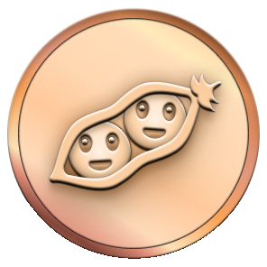</td>
<td align="center">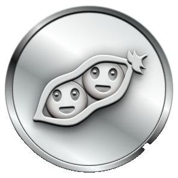</td>
<td align="center">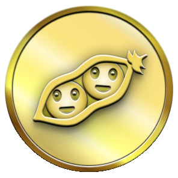</td>
</tr>
</tbody>
</table>

### Starstruck

Stars on a repository you created.

<table>
<thead>
<tr>
<th align="center">Default · 16</th>
<th align="center">Bronze · 128</th>
<th align="center">Silver · 512</th>
<th align="center">Gold · 4096</th>
</tr>
</thead>
<tbody>
<tr>
<td align="center"></td>
<td align="center">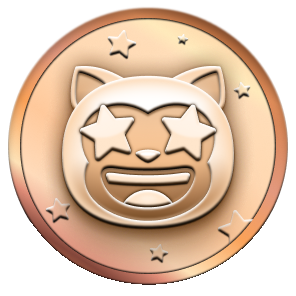</td>
<td align="center">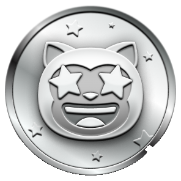</td>
<td align="center">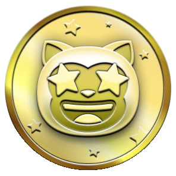</td>
</tr>
</tbody>
</table>

### Galaxy Brain

Accepted answers in Discussions.

<table>
<thead>
<tr>
<th align="center">Default · 2</th>
<th align="center">Bronze · 8</th>
<th align="center">Silver · 16</th>
<th align="center">Gold · 32</th>
</tr>
</thead>
<tbody>
<tr>
<td align="center"></td>
<td align="center">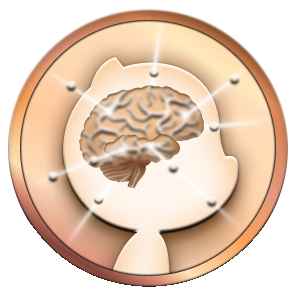</td>
<td align="center"></td>
<td align="center">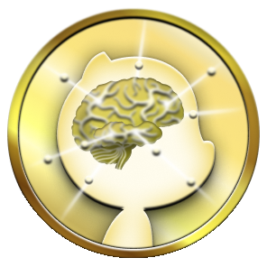</td>
</tr>
</tbody>
</table>

### Pull Shark

Merged pull requests.

<table>
<thead>
<tr>
<th align="center">Default · 2</th>
<th align="center">Bronze · 16</th>
<th align="center">Silver · 128</th>
<th align="center">Gold · 1024</th>
</tr>
</thead>
<tbody>
<tr>
<td align="center"></td>
<td align="center">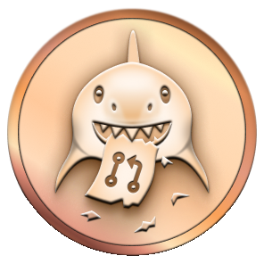</td>
<td align="center">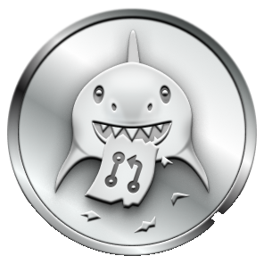</td>
<td align="center">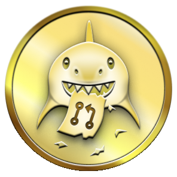</td>
</tr>
</tbody>
</table>

### Heart On Your Sleeve — unreleased

Heart reactions. Experimental; GitHub has not announced a public launch.

<table>
<thead>
<tr>
<th align="center">Default · ?</th>
<th align="center">Bronze · 16</th>
<th align="center">Silver · 128</th>
<th align="center">Gold · ?</th>
</tr>
</thead>
<tbody>
<tr>
<td align="center"></td>
<td align="center">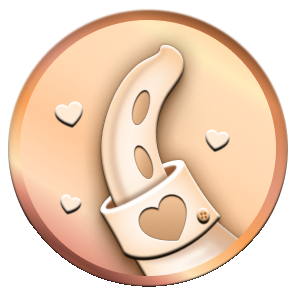</td>
<td align="center">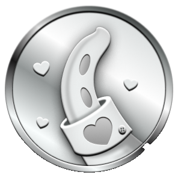</td>
<td align="center">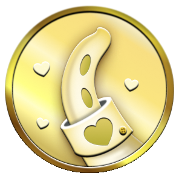</td>
</tr>
</tbody>
</table>

### Open Sourcerer — unreleased

Pull requests merged across multiple public repositories. Experimental; GitHub has not announced a public launch.

<table>
<thead>
<tr>
<th align="center">Default · ?</th>
<th align="center">Bronze · 8</th>
<th align="center">Silver · 16</th>
<th align="center">Gold · 64</th>
</tr>
</thead>
<tbody>
<tr>
<td align="center"></td>
<td align="center">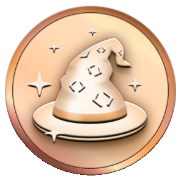</td>
<td align="center">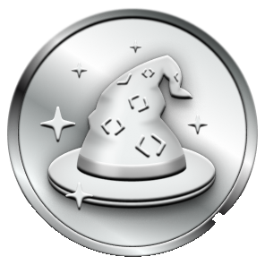</td>
<td align="center">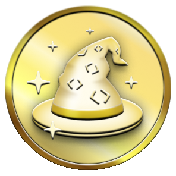</td>
</tr>
</tbody>
</table>

## Highlights

Highlights sit **under** achievements on the profile. They are program badges, not activity achievements. GitHub documents them in the [profile reference](https://docs.github.com/en/account-and-profile/reference/profile-reference#displaying-badges-on-your-profile).

<table>
<thead>
<tr>
<th align="center">Badge</th>
<th>Highlight</th>
<th>How to get</th>
</tr>
</thead>
<tbody>
<tr>
<td align="center"></td>
<td><strong>Pro</strong></td>
<td>Use <a href="https://docs.github.com/en/get-started/learning-about-github/githubs-plans#github-pro">GitHub Pro</a></td>
</tr>
<tr>
<td align="center"></td>
<td><strong>Developer Program Member</strong></td>
<td>Join the <a href="https://docs.github.com/en/integrations/concepts/github-developer-program">GitHub Developer Program</a> and build with the API</td>
</tr>
<tr>
<td align="center"></td>
<td><strong>Security Bug Bounty Hunter</strong></td>
<td>Help find vulnerabilities through <a href="https://bounty.github.com/">GitHub Security</a></td>
</tr>
<tr>
<td align="center"></td>
<td><strong>GitHub Campus Expert</strong></td>
<td>Participate in <a href="https://education.github.com/experts">Campus Experts</a></td>
</tr>
<tr>
<td align="center"></td>
<td><strong>Security advisory credit</strong></td>
<td>Have an advisory accepted into the <a href="https://github.com/advisories">GitHub Advisory Database</a></td>
</tr>
</tbody>
</table>

## Skin tones

Starstruck and Quickdraw follow **Settings → Appearance → Emoji skin tone**.

<table>
<thead>
<tr>
<th></th>
<th align="center">Default</th>
<th align="center">Light</th>
<th align="center">Light medium</th>
<th align="center">Medium</th>
<th align="center">Medium dark</th>
<th align="center">Dark</th>
</tr>
</thead>
<tbody>
<tr>
<td><strong>Starstruck</strong></td>
<td align="center"></td>
<td align="center">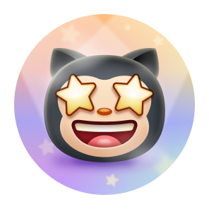</td>
<td align="center">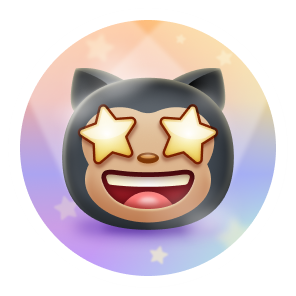</td>
<td align="center">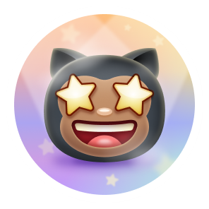</td>
<td align="center">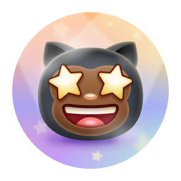</td>
<td align="center">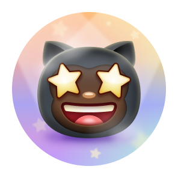</td>
</tr>
<tr>
<td><strong>Quickdraw</strong></td>
<td align="center"></td>
<td align="center">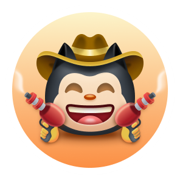</td>
<td align="center">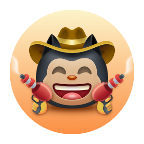</td>
<td align="center">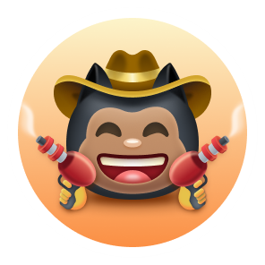</td>
<td align="center">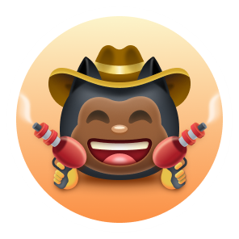</td>
<td align="center">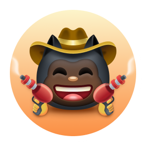</td>
</tr>
</tbody>
</table>

## Unlocked dialogs

Live examples of each badge at 100%. **One profile per badge** — no repeats. Every cell is the same small badge; click the profile to open GitHub’s dialog.

<table>
<tr>
<td align="center" width="50%">
<strong>Pair Extraordinaire</strong><br>
<br>
<a href="https://github.com/DenverCoder1?achievement=pair-extraordinaire&tab=achievements">@DenverCoder1</a>
</td>
<td align="center" width="50%">
<strong>Quickdraw</strong><br>
<br>
<a href="https://github.com/Schweinepriester?achievement=quickdraw&tab=achievements">@Schweinepriester</a>
</td>
</tr>
<tr>
<td align="center">
<strong>Starstruck</strong><br>
<br>
<a href="https://github.com/anuraghazra?achievement=starstruck&tab=achievements">@anuraghazra</a>
</td>
<td align="center">
<strong>Galaxy Brain</strong><br>
<br>
<a href="https://github.com/DenverCoder1?tab=achievements&achievement=galaxy-brain">@DenverCoder1</a>
</td>
</tr>
<tr>
<td align="center">
<strong>Pull Shark</strong><br>
<br>
<a href="https://github.com/ljharb?achievement=pull-shark&tab=achievements">@ljharb</a>
</td>
<td align="center">
<strong>YOLO</strong><br>
<br>
<a href="https://github.com/driesvints?achievement=yolo&tab=achievements">@driesvints</a>
</td>
</tr>
<tr>
<td align="center">
<strong>Public Sponsor</strong><br>
<br>
<a href="https://github.com/christianalberto?achievement=public-sponsor&tab=achievements">@christianalberto</a>
</td>
<td align="center">
<strong>Arctic Code Vault</strong><br>
<br>
<a href="https://github.com/ryo-ma?tab=achievements&achievement=arctic-code-vault-contributor">@ryo-ma</a>
</td>
</tr>
<tr>
<td align="center">
<strong>Mars 2020 Contributor</strong><br>
<br>
<a href="https://github.com/torvalds?achievement=mars-2020-contributor&tab=achievements">@torvalds</a>
</td>
<td align="center">
<strong>Proxima Pioneer</strong> · internal<br>
<br>
<a href="https://github.com/brannon?achievement=proxima-pioneer&tab=achievements">@brannon</a>
</td>
</tr>
<tr>
<td align="center">
<strong>Proxima Staffshipper</strong> · internal<br>
<br>
<a href="https://github.com/brannon?achievement=proxima-staffshipper&tab=achievements">@brannon</a><br>
<em>Only staff profile on this list with Pioneer + Staffshipper.</em>
</td>
<td align="center">
<strong>Proxima Staffuser</strong> · internal<br>
<br>
<a href="https://github.com/timrogers?achievement=proxima-staffuser&tab=achievements">@timrogers</a>
</td>
</tr>
</table>

## Historic designs

From the [Ingenuity announcement](https://github.blog/2021-04-19-open-source-goes-to-mars/) (19 Apr 2021) until the [achievements expansion](https://github.blog/2022-06-09-introducing-achievements-recognizing-the-many-stages-of-a-developers-coding-journey/) (9 Jun 2022), the first three badges used different names and art.

```diff
- GitHub Sponsor
+ Public Sponsor
- Mars 2020 Helicopter Contributor
+ Mars 2020 Contributor
```

<table>
<thead>
<tr>
<th align="center">2021–2022 badge</th>
<th>Name then</th>
</tr>
</thead>
<tbody>
<tr>
<td align="center">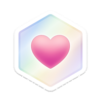</td>
<td>GitHub Sponsor</td>
</tr>
<tr>
<td align="center"></td>
<td>Arctic Code Vault Contributor</td>
</tr>
<tr>
<td align="center"></td>
<td>Mars 2020 Helicopter Contributor</td>
</tr>
</tbody>
</table>

## Visibility & settings

| Goal | Where |
| --- | --- |
| Hide achievements on your profile | [Profile settings](https://github.com/settings/profile#profile-settings-heading) → uncheck *Show Achievements on my profile* |
| Stop private contributions from counting | Same page → contribution & achievement visibility. Docs: [manage visibility](https://docs.github.com/en/account-and-profile/how-tos/contribution-settings/manage-visibility-settings-for-private-contributions-and-achievements) |
| Change Starstruck / Quickdraw skin tone | [Appearance](https://github.com/settings/appearance#emoji-heading) → Emoji skin tone |
| Official (incomplete) reference | [Profile reference](https://docs.github.com/en/account-and-profile/reference/profile-reference#earning-achievements) |

## Mars 2020 qualifying repositories

The Mars 2020 Contributor badge was given for a commit on a repo/version NASA JPL listed. The event has ended. Full official table: [qualifying repositories](https://docs.github.com/en/account-and-profile/reference/profile-reference#list-of-qualifying-repositories-for-mars-2020-helicopter-contributor-achievement).

<details>
<summary>Official list (repo · version)</summary>

| Repository | Version |
| --- | --- |
| [torvalds/linux](https://github.com/torvalds/linux) | 3.4 |
| [python/cpython](https://github.com/python/cpython) | 3.9.2 |
| [nasa/fprime](https://github.com/nasa/fprime) | 1.3 |
| [opencv/opencv](https://github.com/opencv/opencv) | 4.5.1 |
| [numpy/numpy](https://github.com/numpy/numpy) | 1.20.1 |
| [scipy/scipy](https://github.com/scipy/scipy) | 1.6.1 |
| [matplotlib/matplotlib](https://github.com/matplotlib/matplotlib) | 3.3.4 |
| [elastic/elasticsearch](https://github.com/elastic/elasticsearch) | 6.8.1 |
| [curl/curl](https://github.com/curl/curl) | 7.72.0 |
| [twbs/bootstrap](https://github.com/twbs/bootstrap) | 4.3.1 |
| [vuejs/vue](https://github.com/vuejs/vue) | 2.6.10 |
| [pallets/flask](https://github.com/pallets/flask) | 1.1.1 |
| [psf/requests](https://github.com/psf/requests) | 2.25.1 |
| [apache/lucene](https://github.com/apache/lucene) | 7.7.3 |
| [madler/zlib](https://github.com/madler/zlib) | 1.2.11 |

Plus dozens of Python/Java dependencies (boto3, Pillow, pytest, log4j2, joda-time, …). See the official docs for tags.

</details>


## Follow the news

GitHub does not keep a public changelog just for achievements. Staff posts land in **GitHub Community** (the official product forum) and, when they ship a bigger change, on the **Blog** and **Changelog**. Watch those three.

### Forum — where people talk about them

| Place | Why watch it |
| --- | --- |
| **[GitHub Community Discussions](https://github.com/orgs/community/discussions)** | Official product forum. Staff announcements, Q&A, and feedback. This is the main public place to stay on top of achievement changes. |
| **[Search: achievements](https://github.com/orgs/community/discussions?discussions_q=achievements)** | Every Community thread that mentions achievements. Subscribe or check it when something looks new on a profile. |
| **[Feedback thread #44972](https://github.com/orgs/community/discussions/44972)** | Long-running community thread on how badges work, edge cases, and missing criteria. Linked from GitHub’s 2022 launch post. |
| **[Staff: achievements off in Community](https://github.com/orgs/community/discussions/106536)** | Official announcement (6 Feb 2024): you can no longer *earn* achievements inside `github.com/orgs/community`. Badges already earned stay. Repo Discussions elsewhere still count. |
| **[Staff: Heart / Open Sourcerer](https://github.com/orgs/community/discussions/190842)** | Staff confirmed those two were an **experimental rollout**, briefly re-enabled by mistake, then removed again. No public launch date. |

Subscribe to a discussion (the **Subscribe** button on the thread) to get GitHub notifications when staff replies.

### Official public posts from GitHub

| Date | Source | What they announced |
| --- | --- | --- |
| Nov 2019 | [GitHub Universe / Archive Program](https://archiveprogram.github.com/) | Arctic Code Vault: snapshot of public repos to preserve open source for ~1,000 years. |
| 8 Jul 2020 | [Blog: code deposited in the Arctic](https://github.blog/news-insights/company-news/github-archive-program-the-journey-of-the-worlds-open-source-code-to-the-arctic/) | Vault sealed in Svalbard. **Arctic Code Vault Contributor** badge added to profiles of people who contributed to archived repos. |
| 19 Apr 2021 | [Blog: Open source goes to Mars](https://github.blog/news-insights/company-news/open-source-goes-to-mars/) | **Mars 2020 Helicopter** badge for contributors to software used by Ingenuity. GitHub also **introduces the Achievements section** on profiles (Mars, Arctic, Sponsors). |
| 19 Apr 2021 | [The ReadME Project: Ingenuity](https://github.com/readme/featured/nasa-ingenuity-helicopter) | Story behind the Mars badge (~12,000 developers). |
| 9 Jun 2022 | [Blog: Introducing Achievements](https://github.blog/news-insights/product-news/introducing-achievements-recognizing-the-many-stages-of-a-developers-coding-journey/) | Public beta of activity achievements (Pull Shark, YOLO, Galaxy Brain, Starstruck, Pair Extraordinaire, Quickdraw, …). Criteria kept playful on purpose. Opt-out in profile settings. |
| 9 Jun 2022 | [Changelog: Achievements public beta](https://github.blog/changelog/2022-06-09-achievements-public-beta/) | Same ship, in the product changelog. How to hide achievements or exclude private contributions. |
| 6 Feb 2024 | [Community #106536](https://github.com/orgs/community/discussions/106536) | Achievements **turned off in GitHub Community** because of spam (Galaxy Brain farming). Existing progress kept. Other repos unaffected. |

**How to get pinged next time**

1. Watch [github.blog/changelog](https://github.blog/changelog/) (RSS: [github.blog/changelog/feed](https://github.blog/changelog/feed/)) — this is where GitHub lists product ships.
2. Watch [GitHub Community → Announcements](https://github.com/orgs/community/discussions/categories/announcements) — staff posts like the 2024 Galaxy Brain change.
3. Search [github.blog](https://github.blog/?s=achievements) for “achievements”.
4. Official (still incomplete) docs: [Earning Achievements](https://docs.github.com/en/account-and-profile/reference/profile-reference#earning-achievements) and [profile badges / Highlights](https://docs.github.com/en/account-and-profile/reference/profile-reference#displaying-badges-on-your-profile).


Unofficial. Not affiliated with GitHub. Badge artwork belongs to GitHub, Inc. Thresholds are community-reported. If GitHub publishes an official list again, that wins.